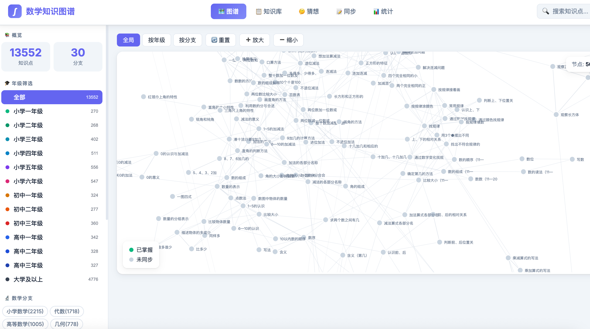

# 📚 Math Knowledge Graph - 数学知识图谱 🦞



> 由 **龙虾 QClaw** 智能生成 ✨
---

## 📖 项目介绍

**数学知识图谱** 是一个全面覆盖从小学到大学、研究级别的结构化数学知识体系项目。该项目用于建模数学概念、定理、公式、分支之间的依赖关系，支持个性化学习路径规划和智能辅导。

### 🎯 项目目的与规划

本项目的核心目标是打造一个**智能数学学习伙伴**，帮助学生更高效地学习和掌握数学知识：

1. **每日知识同步** 📚  
   每天从 QQ 同步学生学习的知识内容，自动构建个人知识图谱

2. **智能对话辅导** 💬  
   与学生对话，聊聊每天学到的知识点，加深理解和记忆

3. **个性化指导** 🎓  
   - 如果学生想增强某方面的知识，可以自动生成类似的练习题目
   - 根据同步的学习进度，智能推荐下一步应该学习的内容

4. **学习路径规划** 🛤️  
   基于知识点的依赖关系，为每个学生规划最优学习路径

---

> **更新时间**: 2026-04-07  
---

## 📊 图谱概览

| 指标 | 数量 |
|------|------|
| **总节点** | 25,355 |
| **总边数** | 105,736 |
| **知识分支** | 50+ |
| **前沿问题** | 1,092 |
| **数学家** | 77 |

---

## 🗂️ 数据结构

### 节点类型分布
| 类型 | 数量 | 说明 |
|------|------|------|
| concept | 21,421 | 核心概念知识点 |
| problem | 1,022 | 数学问题 |
| conjecture | 70 | 数学猜想 |
| mathematician | 77 | 数学家 |
| chapter | 426 | 章节 |
| section | 627 | 小节 |
| theorem | 119 | 定理 |
| formula | 82 | 公式 |

### 边类型分布
| 类型 | 数量 | 说明 |
|------|------|------|
| relates_to | 20,921 | 相关联 |
| prerequisite | 15,790 | 前置知识 |
| follows | 14,295 | 后续知识 |
| belongs_to | 5,296 | 属于 |
| contains | 1,513 | 包含 |
| contributes_to | 554 | 贡献关联 |
| depends_on | 289 | 依赖 |
| influences | 85 | 师承影响 |
| related_to | 42 | 关联 |
| proved_by | 38 | 证明关联 |

---

## 🚀 功能模块

### 1. 知识图谱可视化
- 节点关系可视化
- 分支筛选
- 难度排序
- 前置/后续知识查看

### 2. 🚀 前沿问题 (1,092个)
- **猜想**: 70个（28已证明 🔶23部分证明 ❓16未解决）
- **问题**: 1,022个
- 状态筛选：全部 / 猜想 / 未解 / 已解决
- 详情查看与图谱关联

### 3. 👨‍🔬 数学家 (77位)
- 🏛️ 古代: 2人（欧几里得、阿基米德）
- 📜 近代: 35人（费马、牛顿、欧拉到黎曼）
- 🌟 现代: 24人（希尔伯特、诺特到格罗滕迪克）
- 师承关系可视化
- 贡献领域关联

### 4. 📝 同步学习
- 知识点掌握状态
- 进度追踪
- 复习提醒

### 5. 📊 统计面板
- 年级分布
- 分支覆盖率
- 掌握进度

---

## 📈 分支节点 Top15

| 排名 | 分支 | 节点数 |
|------|------|--------|
| 1 | 小学数学 | 2,215 |
| 2 | 代数 | 1,701 |
| 3 | 信息论深入 | 1,585 |
| 4 | 编码理论深入 | 1,179 |
| 5 | 数学问题 | 1,091 |
| 6 | 数理统计 | 1,051 |
| 7 | 高等数学 | 1,012 |
| 8 | 几何 | 779 |
| 9 | 微分几何 | 736 |
| 10 | 模型论 | 735 |

---

## 🔗 关联增强

### 数学家与问题
- **proved_by**: 38条（怀尔斯→费马大定理、庞加莱→庞加莱猜想等）
- **contributes_to**: 554条（数学家→知识分支）

### 师承关系
- **influences**: 85条
- 示例：欧几里得→高斯、牛顿→欧拉、伽罗瓦→诺特

---

## 🛠️ 技术栈

- **前端**: 原生 JavaScript + D3.js 可视化
- **后端**: Python FastAPI
- **数据**: JSON 图谱文件
- **端口**: 8088

---

## 🚦 启动服务

### 方式一 导入 QClaw（推荐）🦞

将知识图谱导入到 **龙虾 QClaw** 中，通过自然语言对话来进行学习：

1. **导入知识图谱**  
   下载项目， 直接放入～/.qclaw/workspace/

   
2. **启动服务**
   对话加载/启动知识图谱，
   对话开始使用

### 方式二 本地Web服务

```bash
cd ~/.qclaw/workspace/math-knowledge-graph
uvicorn app.api.main:app --host 0.0.0.0 --port 8088
```

访问：http://localhost:8088/web

---

## 📁 关键文件

- `data/core-nodes.json` - 图谱数据
- `app/web/index.html` - 前端页面
- `knowledge_points/` - 知识点文档
- `docs/` - 文档和资料

---

**版本**: 2.0  
**更新**: 2026-04-07

---

## 🙏 开源项目致谢

本项目参考和使用了以下开源项目及技术，感谢它们的贡献：

### 📊 知识图谱参考
| 项目 | 描述 | 链接 |
|------|------|------|
| **Wikidata** | 开放的协作知识库 | https://www.wikidata.org |
| **DBpedia** | 从Wikipedia提取的结构化知识 | https://www.dbpedia.org |
| **Google Knowledge Graph** | 搜索引擎知识图谱 | Google |
| **mathGPT_graph_data** | 数学知识图谱数据结构参考 | GitHub |
| **Label Studio** | 开源数据标注平台 | https://labelstud.io |

### 📚 数学学习资源
| 项目 | 描述 | 链接 |
|------|------|------|
| **Pkmer-Math** | Obsidian数学笔记知识库 | https://github.com/PKM-er/Pkmer-Math |
| **MathWorld** | Wolfram数学百科全书 | https://mathworld.wolfram.com |
| **Wolfram Alpha** | 数学计算与知识引擎 | https://www.wolframalpha.com |
| **Wikipedia** | 数学概念参考来源 | https://wikipedia.org |
| **OEIS** | 整数数列在线百科 | https://oeis.org |
| **arXiv** | 数学预印本论文库 | https://arxiv.org |
| **Khan Academy** | 可汗学院数学课程 | https://www.khanacademy.org |

### 📊 可视化 & 前端
| 项目 | 用途 | 链接 |
|------|------|------|
| **D3.js** | 知识图谱交互式可视化 | https://d3js.org |
| **SVG.js** | 矢量图形渲染 | https://svgjs.com |

### 🐍 后端 & 数据
| 项目 | 用途 | 链接 |
|------|------|------|
| **FastAPI** | API 服务框架 | https://fastapi.tiangolo.com |
| **uvicorn** | ASGI 服务器 | https://www.uvicorn.org |
| **Python** | 数据处理与分析 | https://www.python.org |

### 🧠 AI & 知识库
| 项目 | 用途 | 链接 |
|------|------|------|
| **QClaw | AI 助手框架 | https://qclaw.qq.com/ |
| **AutoGLM** | 深度研究搜索 | - |

### 🛠️ 开发工具
| 项目 | 用途 | 链接 |
|------|------|------|
| **Homebrew** | macOS 包管理 | https://brew.sh |
| **Git** | 版本控制 | https://git-scm.com |
| **MediaWiki** | Wiki系统引擎 | https://www.mediawiki.org |
| **Wiki.js** | 现代Wiki平台 | https://js.wiki |

---

## 💡 贡献方式

欢迎提交 Issue 和 Pull Request！

---

**感谢所有开源社区的贡献者！** 🚀
